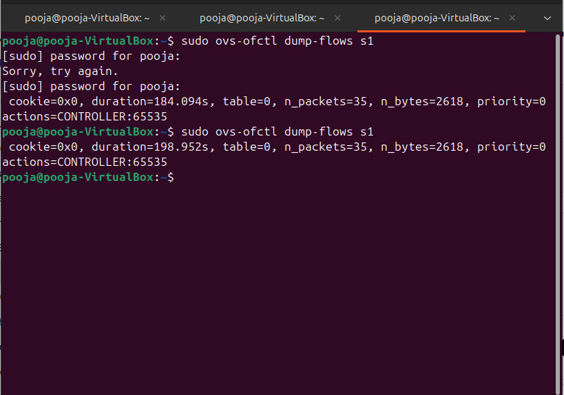
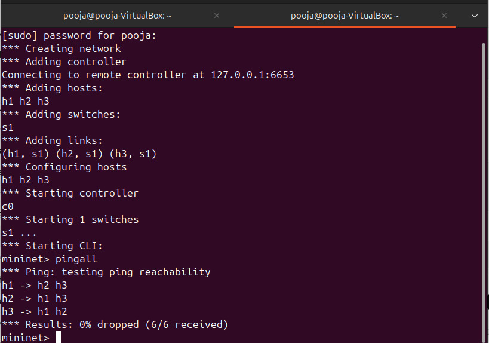
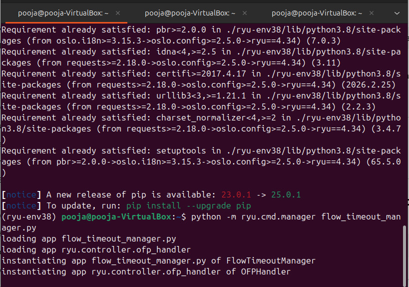

# Flow Rule Timeout Manager

## Overview

This project implements a **Flow Rule Timeout Manager** using Software Defined Networking (SDN). It demonstrates how flow rules are dynamically installed in a switch, monitored, and automatically removed after an idle timeout using the **Ryu Controller**.

---

## Objective

To implement and analyze timeout-based flow rule management in an SDN environment, focusing on:

* Flow rule lifecycle
* Idle timeout behavior
* Automatic removal of expired rules
* Traffic-driven rule reinstallation

---

## Features

* Dynamic installation of flow rules using SDN controller
* Idle timeout configuration for flow entries
* Automatic deletion of inactive/expired rules
* Real-time monitoring of flow rule lifecycle
* Traffic-based rule creation and removal

---

## Technologies Used

* Python
* Ryu SDN Framework
* OpenFlow Protocol
* Mininet (network simulation)
* Linux Environment

---

## Project Structure

```
Flow-Rule-Timeout-Manager/
│
├── flow_timeout_manager.py   # Main SDN controller (flow timeout logic)
├── README.md                 # Project documentation
├── Flow_Table.jpeg
├── Mininet.jpeg
└── RYU_Controller.jpeg
```

---

## Working Principle

1. Switch sends a **packet-in request** to the controller
2. Controller installs flow rules with an **idle timeout**
3. If no packets match the rule → it **expires automatically**
4. Expired rules are removed from the switch
5. New traffic triggers **new rule installation**
6. Entire lifecycle is monitored

---

## How to Run

### 1. Start Ryu Controller

```
ryu-manager flow_timeout_manager.py
```

### 2. Start Mininet Topology

```
sudo mn --topo single,2 --controller remote
```

### 3. Generate Traffic

Inside Mininet CLI:

```
h1 ping h2
```

---

## Expected Output

* Flow rules installed in switch table
* Idle timeout countdown begins
* Rules automatically removed after inactivity
* New rules created when traffic resumes

---

## Screenshots

### Flow Table



### Mininet Topology



### Ryu Controller Output



---

## Learning Outcomes

* Understanding SDN architecture
* Flow rule management in OpenFlow
* Timeout-based lifecycle handling
* Controller-switch communication
* Practical implementation of network automation

---

## Author

**Pooja Koppad**
